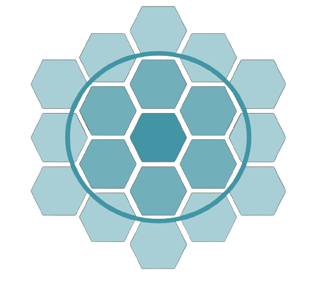
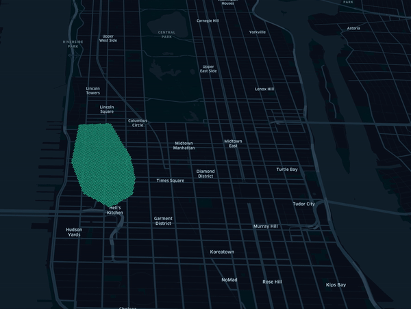
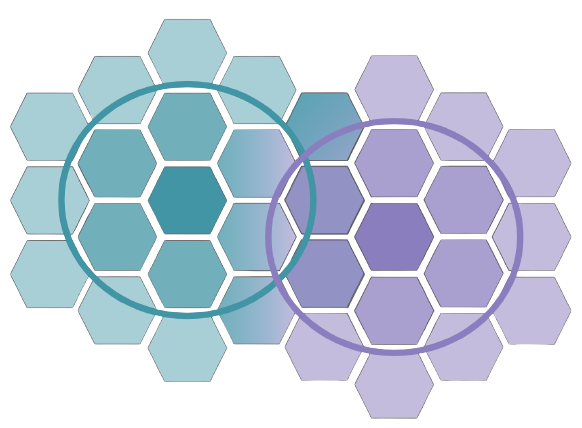

# Geoscan



[DBSCAN](https://www.aaai.org/Papers/KDD/1996/KDD96-037.pdf) (density-based spatial clustering of applications with noise) 
is a clustering technique used to group points that are closely packed together. Compared to other clustering methodologies, 
it doesn't require you to indicate the number of clusters beforehand, can detect clusters of varying shapes and sizes 
and is strong at finding outliers that don't belong to any cluster, hence a great candidate for geospatial analysis of card 
transactions and fraud detection. This, however, comes with a serious price tag: DBSCAN requires all points to be compared 
to every other points in order to find dense neighborhoods where at least `minPts` points can be found within a `epsilon` radius. 

Here comes **GEOSCAN**, our novel approach to DBSCAN algorithm for geospatial clustering, 
leveraging uber [H3](https://eng.uber.com/h3/) library to only group points we know are in close vicinity (according to H3 precision) 
and relying on [GraphX](https://spark.apache.org/docs/latest/graphx-programming-guide.html) to detect dense areas at massive scale. 
With such a framework, Financial services institutions can better understand user shopping behaviours and detect anomalous 
transactions in real time.

### Usage

There are 2 modes our framework can be executed, **distributed** and **pseudo-distributed**.

#### Distributed

Working **fully distributed**, we retrieve clusters from an entire dataframe using the Spark `Estimator` interface, 
hence fully compliant with the Spark Pipeline framework (model can be serialized / deserialized). 
In this mode, the core of GEOSCAN algorithm relies on `GraphX` to detect points having `distance < epsilon` and a `degree > minPoints`. 
See the next section for an explanation of our algorithm.

#### Usage

```python
from geoscan import Geoscan

geoscan = Geoscan() \
    .setLatitudeCol("latitude") \
    .setLongitudeCol("longitude") \
    .setPredictionCol("cluster") \
    .setEpsilon(100) \
    .setMinPts(3)

model = geoscan.fit(points_df)
```


| parameter     | description                                     | default   |
|---------------|-------------------------------------------------|-----------|
| epsilon       | the minimum distance in meters between 2 points | 50        |
| minPts        | the minimum number of neighbours within epsilon | 3         |
| latitudeCol   | the latitude column                             | latitude  |
| longitudeCol  | the longitude column                            | longitude |
| predictionCol | the resulted prediction column                  | predicted |


As the core of GEOSCAN logic relies on the use of H3 polygons, it becomes natural to leverage the same for model 
inference instead of bringing in extra GIS dependencies for expensive point in polygons queries. Our model consists 
in clusters tiled with hexagons of a given resolution (driven by the `epsilon` parameter) that can easily be joined to our original dataframe. 
Model inference is fully supported as per the `Estimator` interface

```python
model.transform(points_df)
```

Note that when saving model to distributed file system, we converted our shapes into [GeoJson](https://tools.ietf.org/html/rfc7946) RFC 7946 
format so that clusters could be loaded as-is into GIS databases or any downstream application or libraries. 

```python
from geoscan import GeoscanModel
model.save('/tmp/geoscan_model/distributed')
model = GeoscanModel.load('/tmp/geoscan_model/distributed')
```

Model can always be returned as a GeoJson object direclty

```python
model.toGeoJson()
```

Finally, it may be useful to extract clusters as a series of H3 tiles that could be used outside of a spark environmnent or outside of GEOSCAN library.
We expose a `getTiles` method that fills all our polygons with H3 tiles of a given dimension, allowing shapes to spill over additional layers should
we want to also "capture" neighbours points.

```python
model.getTiles(precision, additional_layers)
```

This process can be summarized with below picture. Note that although a higher granularity would
fit a polygon better, the number of tiles it generates will grow exponentially.


#### Pseudo Distributed

It is fairly common to extract personalized clusters (e.g. for each user), and doing so sequentially would be terribly inefficient.
For that purpose, we extended our GEOSCAN class to support `RelationalGroupedDataset` and train multiple models in parallel, one for each group attribute. 
Although the implementation is different (using in-memory `scalax.collection.Graph` instead of distributed `GraphX`), 
the core logic remains the same as explained in the next section and should yield the same clusters given a same user.

#### Usage

One must provide a new parameter `groupedCol` to indicate our framework how to group dataframe and train multiple models in parallel.

```python
from geoscan import GeoscanPersonalized

geoscan = Geoscan() \
    .setLatitudeCol("latitude") \
    .setLongitudeCol("longitude") \
    .setPredictionCol("cluster") \
    .setGroupedCol("user") \
    .setEpsilon(100) \
    .setMinPts(3)

model = geoscan.fit(points_df)
```

Note that the output signature differs from the distributed approach since we cannot return a single model but a collection of GEOJSON objects

```python
model.toGeoJson().show()
```

```
+--------------------+--------------------+
|                user|             cluster|
+--------------------+--------------------+
|72fc865a-0c34-409...|{"type":"FeatureC...|
|cc227e67-c6d1-40a...|{"type":"FeatureC...|
|9cafdb6d-9134-4ee...|{"type":"FeatureC...|
|804c7fa2-8063-4ba...|{"type":"FeatureC...|
|65bd17be-b030-44a...|{"type":"FeatureC...|
+--------------------+--------------------+
```

Note that standard `transform` and `getTiles` methods also apply in that mode. By tracking how tiles change overtime, 
this framework can be used to detect user changing behaviour as represented in below animation.



### Algorithm

In this section, we explain the core logic of our algorithm, and how using H3 helps us beat time complexity of standard [DBSCAN](https://www.aaai.org/Papers/KDD/1996/KDD96-037.pdf) model. 
There are typically 3 stages in running a DBSCAN model. 

#### Step1: Grouping

The first step is to link each point to all its neighbours within an `epsilon` distance and remove points having less than `minPts` neighbours. 
Concretely, this means running a cartesian product (`O(n^2)` time complexity) of our dataset to filter out tuples that are more than `epsilon` meters away from one another. In our approach, we leverage H3 hexagons to only group points we know are close enough to be worth comparing. 
As reported in below picture, we first map a point to an H3 polygon and draw a circle of radius `epsilon` that we tile to at least 1 complete ring. 
Therefore, 2 points being at a distance of `epsilon` away would be sharing at least 1 polygon in common, so grouping by polygon would group points in
close vicinity, ignoring 99.99% of the dataset. These pairs can then be further measured using a [haversine](https://en.wikipedia.org/wiki/Haversine_formula) distance.



Even though the theoretical time complexity remains the same (`O(n^2)`), we did not have to run an expensive (and non realistic) cartesian product
of our entire dataframe. The real time complexity is `O(p.k^2)` where `p` groups are processed in parallel, running cartesian product of `k` points (`k << n`) sharing a same H3 hexagon, hence scaling massively. This isn't magic though, and prone to failure when data is heavily skewed to dense area, so understand your data is key before running this job as-is. With heavy skewed, it would be recommended to sample the data for specific polygons. Furthermore, we first had to explode our dataset X-fold to cover points against multiple polygons, but an extra complexity upfront makes the grouping much faster. 
 
#### Step2: Clustering

The second step is trivial when using a graph paradigm. As we found the pairs being no more than `epsilon` meters away, we
simply remove vertices with less than `minPts` connections (`degrees < minPts`). By removing these border nodes, clusters start to form
and can be retrieved via a `connectedComponents`. 

```scala
val clusters = graph
  .outerJoinVertices(graph.degrees)((_, point, deg) => (point, deg.getOrElse(0)))
  .subgraph(
    edge => edge.dstAttr.distance(edge.srcAttr) < epsilon, 
    (vId, vData) => vData._2 >= minPts)
  .connectedComponents()
```

#### Step3: Convex Hulls

As all our core points are defining our clusters, the final step is to find the [Convex Hull](https://en.wikipedia.org/wiki/Convex_hull), that is the smallest shape that include all of our points. There are plenty of litterature on that topic, and our approach can easily be used in memory for each cluster returned by our connected components.
Note that - as much as we do want to support non convex hull - we could not find a method / library to identify concave shapes efficiently. 
We do welcome contribution though.

### Installation

Compile GEOSCAN scala library that can be uploaded onto a Databricks cluster (DBR > 7.x). Activate `shaded` profile to include GEOSCAN dependencies as an assembly jar and unit test python wrapper

```shell
mvn clean package -Pshaded
```

For python wrapper, install the dependencies locally using the magic `%pip` command. Longer term, this wrapper will be available as a `pypi` dependency.

```shell script
%pip install /path/to/geoscan/python
```

### Dependencies

We only use 2 external dependencies in addition to the standard Spark stack. As mentioned, H3 is used extensively to group latitude and longitude in order to beat the `O(n2)` complexity.
`scala-graph` is used in our pseudo distributed mode when training in-memory clusters (in lieu of GraphX).

```xml
<dependency>
    <groupId>com.uber</groupId>
    <artifactId>h3</artifactId>
    <version>3.6.3</version>
</dependency>

<dependency>
    <groupId>org.scala-graph</groupId>
    <artifactId>graph-core_2.12</artifactId>
    <version>1.12.5</version>
</dependency>
```

### Release process

Once a change is approved, peer reviewed and merged back to `master` branch, a GEOSCAN admin will be able to promote 
a new version to maven central as follows (provided tests validated by our CI/CD pipeline).

```shell script
mvn release:prepare
mvn release:perform
```

This will create a new version on maven central

```xml
<dependency>
    <groupId>com.databricks.labs</groupId>
    <artifactId>geoscan</artifactId>
    <version>1.0</version>
</dependency>
```

### Project support

Please note that all projects in the /databrickslabs github account are provided for your exploration only, and are 
not formally supported by Databricks with Service Level Agreements (SLAs). They are provided AS-IS and we do not make 
any guarantees of any kind. Please do not submit a support ticket relating to any issues arising from the use of these projects.

Any issues discovered through the use of this project should be filed as GitHub Issues on the Repo. They will be reviewed 
as time permits, but there are no formal SLAs for support.

### Author

<antoine.amend@databricks.com>
